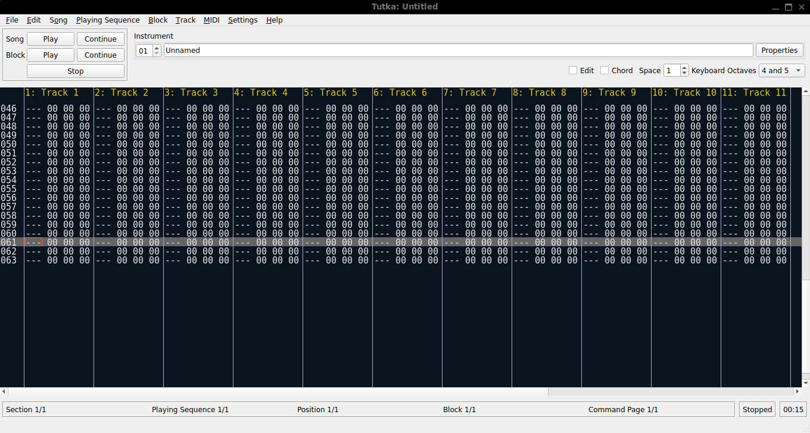

# Tutka 1.1.3 - Modern Debian Build 🐉

2015 chiptune tracker fixed for 2026 Debian 13+ (GCC14/Qt5.15)  
Tutka is a free (as in freedom) tracker style MIDI sequencer for GNU/Linux and Mac OS X

## Install
```bash
sudo apt install qt5-default libasound2-dev
wget [your-deb]
sudo dpkg -i tutka.deb
tutka

# Tutka 1.1.3 - Modern Debian Build 🐉

2015 chiptune tracker fixed for 2026 Debian 13+ (GCC14/Qt5.15)

## Install
```bash
sudo apt install qt5-default libasound2-dev
wget [your-deb]
sudo dpkg -i tutka.deb
tutka
```  


