# Tutka Manual

# Table of Contents

- [Blocks](#blocks)
- [Lines](#lines)
- [Tracks](#tracks)
- [Instruments](#instruments)
- [Editing](#editing)
  - [Cursor](#cursor)
  - [Note, Instrument, and Command Positions](#note-instrument-and-command-positions)
- [Commands](#commands)
- [Playing Sequence](#playing-sequence)
  - [Sections](#sections)
- [Main Window](#main-window)
  - [Block List](#block-list)
  - [Playing Sequence](#playing-sequence-1)
  - [Playing Sequence List](#playing-sequence-list)
  - [Section List](#section-list)
  - [Instrument Properties](#instrument-properties)
  - [Open File](#open-file)
  - [Save As](#save-as)
  - [Transpose](#transpose)
  - [Expand/Shrink](#expandshrink)
  - [Change Instrument](#change-instrument)
  - [Track Volumes](#track-volumes)
  - [Song Properties](#song-properties)
  - [Message List](#message-list)
  - [Load Message](#load-message)
  - [Save Message](#save-message)
  - [Receive MIDI Message](#receive-midi-message)
  - [Preferences](#preferences)
  - [About](#about)
  - [Quit](#quit)
- [Keyboard Commands](#keyboard-commands)
- [Step by Step](#step-by-step)
  - [MIDI Setup](#midi-setup)
  - [Setting the Tempo](#setting-the-tempo)
  - [Organizing Tracks](#organizing-tracks)
  - [Writing Blocks](#writing-blocks)
  - [Setting the Playback Order](#setting-the-playback-order)
  - [Structuring the Song](#structuring-the-song)

---

## Blocks
In Tutka, songs are constructed from units called **blocks**. These blocks can be arranged in any order to create a complete song by placing them into a playback sequence. You can **create, delete, and modify** the properties of blocks using the **Block List** window. To open the Block List window, select **List** from the **Block** menu, or click the **Block** label located in the bottom-right corner of the main window. Additionally, the Block List window allows you to choose which block is currently visible and editable.

## Lines
Each block corresponds to a specific segment of time, representing a portion of the song. This segment is further divided into **lines**, which are arranged vertically. A block starts at the top and continues to the bottom. All elements on a single line are played at the same time. If the playback speed remains constant, every line has an equal length. A block can contain **any number of lines**, and the total number of lines in a block can be adjusted through the Block List window.

## Tracks
Blocks are also divided **horizontally into tracks**. Multiple tracks enable the use of multiple notes on the same line, since each track can hold only one note at a time. Each track can accommodate one note along with one or more commands for every line within the block. There is no fixed limit on the number of tracks a block can have, and the number of tracks can also be modified using the Block List window.

Every track has a **global master volume** that ranges from 0 (minimum) to 127 (maximum). This volume controls the track’s level across the entire song. Tracks can additionally be **muted**, preventing their contents from being played. These settings are managed through the **Track Volumes** window, which can be opened by selecting **Track Volumes** from the **Song** menu.

---

## Instruments
Each note in Tutka is played through an **instrument**. Instruments can have a variety of properties, including a **name**, **MIDI interface**, **MIDI channel**, **default volume**, **hold time**, and more. Instruments are identified using numbers from 1 to 9 and letters from A to Z.

The **currently active instrument** is displayed in the top-right corner of the main window. This active instrument is used when playing or adding notes into blocks via the keyboard. You can select the active instrument using the **numeric keypad**: with Num Lock on, the **1 key** selects instrument 1, the **divide key** selects instrument 2, and so forth.  

You can also switch to the **previous or next instrument** by holding the **Control key** and pressing the **left or right cursor keys**, respectively.  

The active instrument’s properties can be modified using the **Instrument Properties** window, which is opened by clicking the **Properties** button in the top-right part of the main window.

---

## Editing
Notes can be both **played and entered** using the keyboard. The keyboard is organized into **two octaves**. For the lower octave, the keys **Z S X D C V G B H N J M** correspond to the notes. For the upper octave, the keys **Q 2 W 3 E R 5 T 6 Y 7 U** are used.  

The active octave can be selected either by pressing the **function keys** or by using the **Keyboard Octaves** selector in the main window. All notes are played using the **currently active instrument**.

### Cursor
The **current block** is displayed in the main area of the main window. The **cursor** indicates the position currently being edited. You can move the cursor around a block using the **cursor keys**.  

Each line in the block contains **six possible cursor positions per track**:  
1. The **note position**  
2. The **instrument position**  
3. Two **command positions**  
4. Two **command value positions**  

### Note, Instrument, and Command Positions
- **Note Position:** When the cursor is in a note position, the keyboard can be used to play notes with the current instrument. If the **Edit** checkbox is checked, the note played is also inserted into the current cursor position, and the cursor moves downward by the number of lines specified using the **Space selector** in the main window. The Edit checkbox can be toggled on and off using the **Space key**.  

- **Instrument Position:** When the cursor is in an instrument position, you can use the keys **0-9** and **A-Z** to select the instrument that will play the note at the note position.  

- **Command/Command Value Positions:** When the cursor is in a command or command value position, the keys **0-9** and **A-F** can be used to enter the desired command for the particular line and track of the block.

---

## Commands

Commands in Tutka are used to control various aspects of a track, including **volume**, **aftertouch**, **pitch bending**, and **note delays**. Some commands, such as the **tempo command**, affect playback globally, regardless of the track on which they are placed. Commands can also be used to control **MIDI controllers**. On a block, commands are positioned on the **right side of the notes** within each track.

Each command consists of **two byte-sized integers** represented in **hexadecimal**. The **first byte** is the **command number**, and the **second byte** is the **value** assigned to that command. Command numbers **00-7F** are reserved for Tutka’s internal commands, while numbers **80-FF** correspond to **MIDI controllers 0-127**, with the MIDI controller number calculated as the command number minus 80.

Most commands, including all MIDI controller commands, have a value range of **00-7F**, following the precision defined by the MIDI protocol. For these commands, values in the range **80-FF** are used to **slide the value** from the previous value to the defined value minus 80 over the duration of the line where the command is applied.

Each block supports **multiple command pages**, allowing several commands to be placed on the same line within the same track. The **active command page** is displayed in the **lower-right corner** of the main window. You can switch to the next command page by pressing **Control + Tab**. The total number of command pages in a block can be adjusted using the **Block List** window.

### Table 1: Command Numbers and Their Descriptions

| Command | Description | Value Range |
|---------|-------------|-------------|
| 00      | Set/slide value of previously used command | 00-7F (slide 80-FF) |
| 01      | Set/slide pitch wheel | 00-7F (slide 80-FF) |
| 02      | End block, set line | 00-FF |
| 03      | Set playing sequence position | 00-FF |
| 07      | Send program change | 00-7F |
| 08      | Send System Exclusive message | 00-FF |
| 09      | Set hold value | 00-FF |
| 0A      | Retrigger note | 00-FF |
| 0B      | Note delay | 00-FF |
| 0C      | Velocity / aftertouch / note off | 00-7F (slide 80-FF) |
| 0D      | Set channel pressure | 00-7F (slide 80-FF) |
| 0E      | Set ticks per line / Stop | 00-FF |
| 0F      | Set tempo / Stop | 00-FF |
| 80-FF   | Set/slide MIDI controller value | 00-7F (slide 80-FF) |

---

## Playing Sequence
The **playing sequence** defines the order in which blocks are played. A single block can be played multiple times or might not be played at all, for example, when it is used only for **testing or editing purposes**. The playing sequence can be modified using the **Playing Sequence** window, which is opened by clicking the **Playing Sequence** button located in the **bottom-middle** area of the main window.

### Sections
To provide further structure to a song, multiple playing sequences can be combined and arranged in any order. These sequences can be created within the **Playing Sequence** window and then added to the **Section List** to determine their overall playback order. The Section List can be thought of as a **playing sequence of playing sequences**. The Section List can be edited using the **Section List** window, which is accessed by clicking the **Section List** button in the **bottom-left** area of the main window.

---

## Main Window

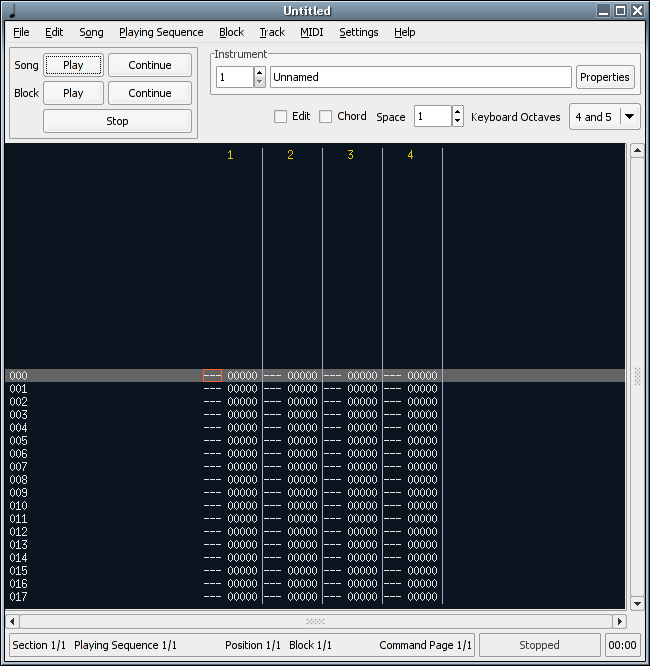

The main window contains the primary controls of Tutka.

The playback controls are in the top left corner. The buttons can be used to play the song from the beginning, to continue playing the song from the current position, to play the current block from the beginning, to continue playing the current block from the current position, and to stop playback.

The Instrument section in the top right corner contains the selector for the current instrument. The spin button can be used to select the instrument to use for editing. The text field shows the name of the current instrument. The **Properties** button opens the Instrument properties dialog which can be used to edit the properties of the current instrument.

Below the Instrument section are some miscellaneous toggles and settings used while editing:

- The **Edit** check box toggles edit mode on or off. When edit mode is on, notes can be entered in the tracker view.
- The **Chord** check box toggles chord mode on or off. When chord mode is on, the cursor advances to the next track when a key is pressed and goes back when the key is released. This can be used to enter chords in the tracker view.
- The **Space** spin button is used to select how many lines the tracker advances when a note is entered in edit mode.
- The **Keyboard Octaves** combobox is used to select which octaves are played when the keyboard is used to enter or play notes.

The middle part of the main window contains a tracker view that displays one block of the song at a time. This is where all actual editing is done.

The bottom part contains a status bar that shows the currently active section, playing sequence, playing sequence position, block, and command page. The **Section**, **Playing Sequence**, **Position**, and **Block** labels can also be clicked to open the Section list, Playing sequence list, Playing sequence, and Block list windows, respectively. There are also two separate status fields for the current playing status and current playing time.

---

### Block List

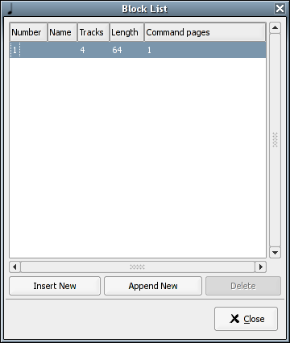

The Block List window can be used to select the current block, create new blocks, delete existing blocks, and change the properties of the blocks.

- To select a block, click on the line that displays information about the block you want to select.
- To insert a new block before the current block, click on the **Insert New** button.
- To append a new block after all blocks, click on the **Append New** button.
- To delete the current block, click on the **Delete** button.
- To change the name of the current block, click on the **Name** cell of the current block in the block list. The cell changes to a text entry field, and you can edit the name of the block. Press Enter when done.
- To change the number of tracks in the current block, click on the **Tracks** cell of the current block in the block list. The cell changes to a numeric entry field, and you can change the number of tracks in the block. Press Enter when done.
- To change the length of the current block, click on the **Length** cell of the current block in the block list. The cell changes to a numeric entry field, and you can change the number of lines in the block. Press Enter when done.
- To change the number of command pages in the current block, click on the **Command Pages** cell of the current block in the block list. The cell changes to a numeric entry field, and you can change the number of command pages in the block. Press Enter when done.

---

### Playing Sequence

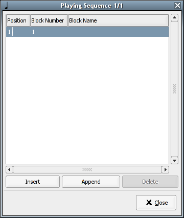

The Playing Sequence window can be used to select the current position in the current playing sequence, insert new positions, delete existing positions, and change the block to be played in different playing sequence positions.

- To select a playing sequence position, click on the line that displays information about the playing sequence position you want to select.
- To insert a new position before the current position, click on the **Insert** button.
- To append a new position after all positions, click on the **Append** button.
- To delete the current position, click on the **Delete** button.
- To change the block number to play in the current playing sequence position, click on the **Block Number** cell of the current position in the position list. The cell changes to a numeric entry field, and you can edit the number of the block to be played. Press Enter when done.

---

### Playing Sequence List

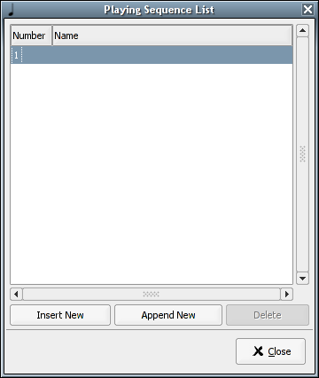

The Playing Sequence List window can be used to select the current playing sequence, insert new playing sequences, delete existing playing sequences, and change the name of the current playing sequence.

- To select a playing sequence, click on the line that displays information about the playing sequence you want to select.
- To insert a new playing sequence before the current playing sequence, click on the **Insert** button.
- To append a new playing sequence after all playing sequences, click on the **Append** button.
- To delete the current playing sequence, click on the **Delete** button.
- To change the name of the current playing sequence, click on the **Name** cell of the current playing sequence in the playing sequence list. The cell changes to a text entry field, and you can edit the name of the playing sequence. Press Enter when done.

---

### Section List

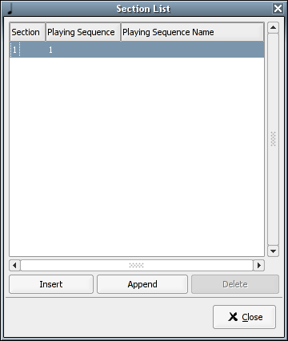

The Section List window can be used to select the current section, insert new sections, delete existing sections, and change the playing sequence to be played in different sections.

- To select a section, click on the line that displays information about the section you want to select.
- To insert a new section before the current section, click on the **Insert** button.
- To append a new section after all sections, click on the **Append** button.
- To delete the current section, click on the **Delete** button.
- To change the playing sequence number to play in the current section, click on the **Playing Sequence** cell of the current section in the section list. The cell changes to a numeric entry field, and you can edit the number of the playing sequence to be played. Press Enter when done.

---

### Instrument Properties

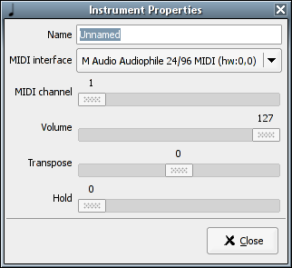

The Instrument Properties window can be used to change the **name**, **MIDI interface**, **MIDI channel**, **volume**, **transpose**, and **hold** of the current instrument.

- The **MIDI interface** combo box shows all available MIDI interfaces and an option for no output.  
- **MIDI channel** is the MIDI channel to use (on the selected MIDI interface), ranging from 1 to 16.  
- **Volume** is the default volume (velocity) of the instrument, from 0 to 127.  
- **Transpose** is the number of half-notes to transpose the instrument when played. The valid range is from -24 (two octaves down) to 24 (two octaves up).  
- **Hold** defines the default hold value for the instrument — the number of ticks until the played note is stopped. The valid range is from 0 to 255. If the hold value is 0, the note will not be stopped until another note is played on the same track or playback is stopped.

---

### Open File

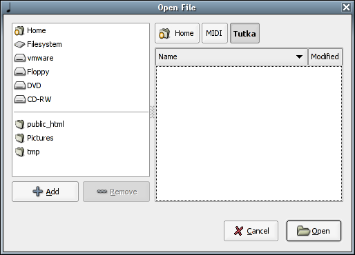

The Open File dialog can be used to load a Tutka XML file or an MMD song.

### Save As

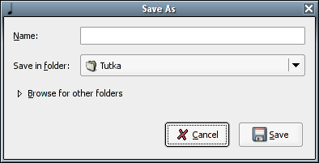

The Save As dialog can be used to save the current song as a Tutka XML file, as an MMD song, or as an SMF (MIDI) file. The file format depends on the file extension:  
- `.med`, `.mmd`, and `.mmd2` save as an MMD file  
- `.mid` saves as an SMF file  
- Other extensions save in Tutka format

---

### Transpose

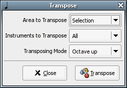

The Transpose dialog can be used to transpose a part of the song. The area to transpose can be the entire song, the current block, the current track, or a selection. You can select whether to transpose **all instruments** in the area or just the **current instrument**. The notes can be transposed **octave up**, **octave down**, **halfnote up**, or **halfnote down**.

---

### Expand/Shrink

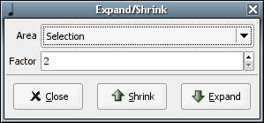

The Expand/Shrink dialog can be used to expand or shrink a part of the song. **Expanding** means adding empty lines between existing lines. **Shrinking** means removing lines between lines. Expand/Shrink does **not** change the length of the block, so before expanding make sure there is enough space for all notes to fit.  

The area to expand/shrink can be the entire song, the current block, the current track, or a selection. You can select how many lines to **add between each line** (expand) or how many lines to **delete after each line** (shrink).

---

### Change Instrument

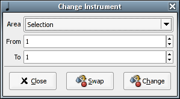

The Change Instrument dialog can be used to change an instrument to another in a part of the song. The area for changing instruments can be the entire song, the current block, the current track, or a selection.  

- The **From** and **To** fields are used to select the instrument number to change and the instrument number to change to.  
- You can also **swap instruments** instead of changing them using the **Swap** button.

---

### Track Volumes

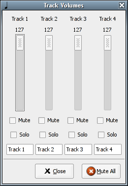

The Track Volumes dialog is used to set the default volume of each track. All volumes range from 0 to 127. Tracks can also be **muted** (muted tracks are not played) or **soloed** (if tracks are soloed, the tracks that are not soloed are not played). Descriptive names can also be added to tracks.  

**Note:** The number of tracks displayed in the Track Volumes dialog is the maximum number of tracks in the current song. If the maximum number of tracks in the current song decreases, tracks are removed from the Track Volumes dialog and their names are lost.

---

### Song Properties

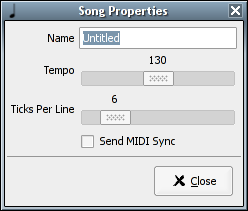

The Song Properties dialog is used to set the **name** and **tempo** of the current song.  

- The **Tempo** slider sets the tempo of the song in beats per minute.  
- The **Ticks per line** slider sets how many MIDI ticks each tracker line represents. In MIDI, a quarter (1/4) note is 24 ticks long, so the default value of 6 ticks means that each line represents a 1/16 note.

---

### Message List

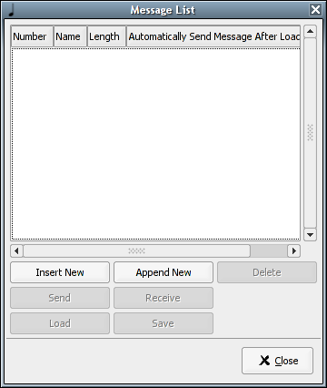

The Message List dialog allows you to create, delete, send, receive, load, and save MIDI messages, set their names and lengths, and determine whether they should be automatically sent after loading. Before MIDI messages can be sent, received, loaded, or saved—or before their properties can be changed—they must first be created.

- To select a MIDI message for editing, click on the row that contains information about the MIDI message.  
- To insert a new MIDI message before the currently selected message, click the **Insert New** button.  
- To append a new MIDI message after all messages, click the **Append New** button.  
- To delete the currently selected MIDI message, click the **Delete** button.  
- To send the currently selected MIDI message, click the **Send** button.  
- To receive a MIDI message from a MIDI interface as the currently selected message, click the **Receive** button to open the Receive MIDI Message dialog.  
- To load a raw MIDI message from disk as the currently selected message, click the **Load** button to open the Load Message dialog.  
- To save the currently selected message to a file as a raw MIDI message, click the **Save** button to open the Save Message dialog.  
- To change the name of the current message, click on the **Name** cell of the message list row that contains information about the message. The cell will change into a text entry field so you can edit the name. Press Enter when done.  
- To change the length of the current message, click on the **Length** cell of the message list row that contains information about the message. The cell will change into a numeric entry field so you can edit the length. Press Enter when done.  
- To define that the current message should be automatically sent after loading the song, click on the checkbox in the **Automatically send message after loading** cell of the message list row that contains information about the message.

---

### Load Message

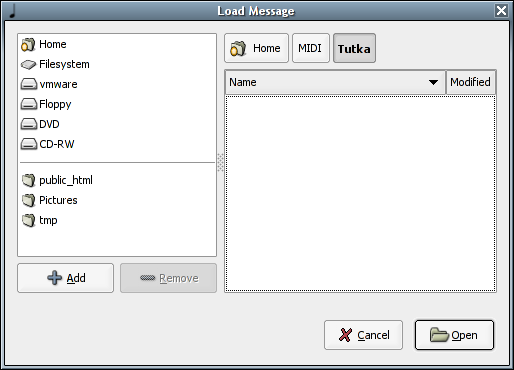

The Load Message dialog can be used to load a raw MIDI message from a file as the currently selected message.

---

### Save Message

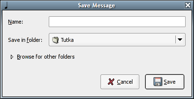

The Save Message dialog can be used to save the currently selected message to a file as a raw MIDI message.

---

### Receive MIDI Message

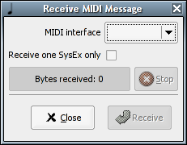

This dialog allows you to receive a MIDI message to the currently selected message.

- The **MIDI interface** combo box shows all MIDI interfaces that are enabled for input in the preferences. At least one MIDI interface must be enabled for input to receive a MIDI message.  
- Receiving can be started using the **Receive** button.  
- Receiving can be stopped using the **Stop** button.  

---

### Preferences

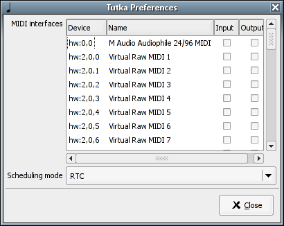

- The **MIDI interfaces list** allows you to select which of the available MIDI interfaces are to be used for input and which for output. If a MIDI interface is not enabled for output, notes sent to it using an instrument that has the MIDI interface defined are not played. If a MIDI interface is not enabled for input, MIDI messages cannot be received through the interface and the interface is not used for receiving notes.  

- The **Scheduling mode** is used to control how Tutka schedules the player.  
  - **RTC** is currently the most accurate method but may require the system administrator to give the user rights to use at least a 512 Hz RTC timer by running `sysctl dev.rtc.max-user-freq to 512`.  
  - **Nanosleep** is another option but is not very accurate.  

If RTC timing is selected, Tutka tries to use a 2048 Hz timer if available. If it fails, it tries 1024 Hz and 512 Hz, and if neither of those are available, it falls back to the Nanosleep method.  

Even a 2048 Hz timer is not precise enough, so Tutka busy-loops until the exact moment. This causes a slight CPU load while Tutka is playing.  

Elevated privileges and priorities can enhance timing accuracy.

---

### About

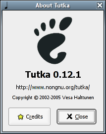

This dialog displays information about the version of Tutka you are running.

---

### Quit

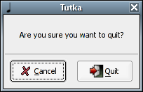

This dialog allows you to quit Tutka by clicking on **Quit**. Click **Cancel** to cancel.

---

## Keyboard Commands

| Key (combination)      | Command description                        |
|-----------------------|--------------------------------------------|
| Cursor up             | Move cursor one line up                     |
| Cursor down           | Move cursor one line down                   |
| Cursor left           | Move cursor one position left               |
| Cursor right          | Move cursor one position right              |
| Home                  | Move cursor to first line                   |
| End                   | Move cursor to last line                    |
| Page up               | Move cursor 8 lines up                      |
| Page down             | Move cursor 8 lines down                    |
| Space                 | Stop, toggle edit mode on/off               |
| Tab                   | Move cursor to next track                   |
| Shift+Tab             | Move cursor to previous track               |
| Ctrl+Shift+Tab        | Next command page                           |
| F1-F9                 | Select keyboard octaves                     |
| Backspace             | Delete current line (current track)        |
| Shift+Backspace       | Insert line (current track)                 |
| Alt+Backspace         | Delete current line                         |
| Alt+Shift+Backspace   | Insert line                                 |
| Del                   | Clear current note                           |
| Shift+Del             | Clear current note and commands             |
| Ctrl+Del              | Clear current commands                       |
| Ctrl+B                | Selection mode on/off                        |
| Ctrl+K                | Clear to the end of track                    |
| Ctrl+N                | New song                                     |
| Ctrl+O                | Open song                                    |
| Ctrl+S                | Save song                                    |
| Shift+Ctrl+S          | Save song as                                 |
| Ctrl+P                | Print song                                   |
| Ctrl+Q                | Quit                                         |
| Ctrl+X                | Cut selection                                |
| Ctrl+C                | Copy selection                               |
| Ctrl+V                | Paste selection                              |
| Ctrl+F3               | Cut block                                    |
| Ctrl+F4               | Copy block                                   |
| Ctrl+F5               | Paste block                                  |
| Shift+F3              | Cut track                                    |
| Shift+F4              | Copy track                                   |
| Shift+F5              | Paste track                                  |
| Ctrl+0-9              | Set space value                              |
| Shift+Cursor left     | Previous playing sequence position          |
| Shift+Cursor right    | Next playing sequence position              |
| Alt+Cursor left       | Previous block                               |
| Alt+Cursor right      | Next block                                   |
| Ctrl+Cursor left      | Previous instrument                          |
| Ctrl+Cursor right     | Next instrument                              |
| Alt+1-9               | Mute tracks                                  |
| Ctrl+Alt+1-9          | Solo tracks                                  |
| Right Shift           | Play block                                   |
| Right Ctrl            | Play song                                    |

---

## Step by Step

This guide walks you through creating a song in Tutka from start to finish.

---

### MIDI Setup

Before composing, set up your MIDI devices. Each MIDI instrument should have a unique MIDI channel to prevent conflicts. Then, configure your Tutka instruments to correspond to these MIDI devices. Assign each Tutka instrument the appropriate MIDI channel so you can play different MIDI instruments independently through Tutka.

If your MIDI devices cannot store their instrument setup internally, you can use SysEx messages to save and restore their configurations. Tutka can receive these SysEx messages and resend them to the devices using the **Message List** window.

---

### Setting the Tempo

Once MIDI is configured, determine the tempo of your song using the **Song Properties** window. Tempo is measured in beats per minute (BPM).  

Additionally, choose how many MIDI ticks each tracker line represents using the **Ticks per line** setting. By default, 6 ticks correspond to 1/16 notes. If your song requires finer resolution, for example 1/32 notes, reduce this value to 3.

---

### Organizing Tracks

Decide how many tracks each block will use. It's helpful to assign tracks consistently across the entire song—for example, dedicating one track for bass drum, another for snare, and a third for hi-hats. This way, instruments remain predictable across blocks, and you can label tracks clearly in the **Track Volumes** window.

Keep in mind that each track can only play one note at a time, so thoughtful track assignment helps prevent overlapping notes from interfering with each other.

---

### Writing Blocks

In Tutka, songs are typically composed one block at a time. Each block represents a specific part of the song, and its length can be chosen to suit your needs. Keeping blocks relatively short is usually convenient, as it allows you to reuse the same block multiple times without having to create a nearly identical new block.

Once the block length is set, you can enter notes and related commands. The block can be played back and edited repeatedly until it meets your expectations.

When a block is complete, you can create a new one. This new block can either continue from where the previous one ended or exist as a completely separate section. The order in which you create blocks does not have to match the final playback order. It is often practical to create blocks for the main ideas of the song first, before filling in transitional sections and details.

---

### Setting the Playback Order

After you have created the necessary blocks, you can define the order in which they will be played back in the final song. This is done by creating a **playing sequence** in the **Playing Sequence** window, which can be opened by clicking the **Position** label at the bottom of the main window.

When the song is played, blocks follow the order defined in the playing sequence. The same block can be included multiple times if it needs to repeat.

---

### Structuring the Song

For longer songs or repeated sections, it can be useful to group multiple blocks into larger sequences. Instead of repeatedly defining the same block order in the playing sequence, you can create several **playing sequences**.  

For example, a song might have an **intro**, **verse**, and **chorus**, with the verse and chorus repeated twice. Each of these parts can be defined as a separate playing sequence using the **Playing Sequence List** window. Then, the overall order of these sequences can be arranged in the **Section List** window, creating a clear, organized structure for the song.

